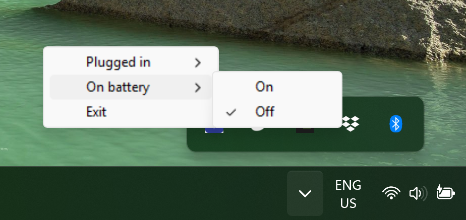

# Turbo Boost Manager

A simple and lightweight system tray application for managing CPU Turbo Boost settings on Windows systems.


## Overview

[ ]

Turbo Boost Manager provides an easy-to-use interface for controlling your CPU's turbo boost functionality directly from the Windows system tray. It allows you to quickly enable or disable turbo boost for both AC power (plugged in) and battery power scenarios without diving into complex power management settings.

## Features

- 🖥️ **System Tray Integration** - Convenient access from Windows system tray
- 🔋 **Dual Power Mode Support** - Separate settings for AC power and battery operation
- 💾 **State Persistence** - Remembers your settings between sessions
- 📊 **Real-time Control** - Instant application of power settings
- 🎯 **Lightweight** - Minimal resource usage
- 🔄 **Auto-apply on Startup** - Automatically applies saved settings when launched

## How It Works

### Technical Implementation

Turbo Boost Manager works by interfacing with Windows' built-in `powercfg` utility to modify CPU power management settings. Specifically, it manipulates the **Processor Throttle Maximum** parameter in the active power scheme.

#### Power Configuration Parameters

The application modifies the following powercfg parameters:

- **Setting Location**: `SUB_PROCESSOR\PROCTHROTTLEMAX`
- **AC Power (Plugged In)**: Uses `/setacvalueindex` command
- **DC Power (On Battery)**: Uses `/setdcvalueindex` command

#### Turbo Boost Control Logic

- **Turbo Boost ON**: Sets processor throttle maximum to `100%`
- **Turbo Boost OFF**: Sets processor throttle maximum to `99%`

The 1% difference effectively disables turbo boost while maintaining normal CPU operation, as turbo boost typically requires 100% processor state to activate.

#### Command Execution Flow

1. **Get Active Power Scheme**:
   ```
   powercfg /getactivescheme
   ```

2. **Modify Power Setting**:
   ```
   powercfg /setacvalueindex <GUID> SUB_PROCESSOR PROCTHROTTLEMAX <value>
   powercfg /setdcvalueindex <GUID> SUB_PROCESSOR PROCTHROTTLEMAX <value>
   ```

3. **Apply Changes**:
   ```
   powercfg /setactive <GUID>
   ```

## Installation

### Prerequisites

- Windows 10/11 (64-bit)
- Administrator privileges (required for powercfg operations)

### Option 1: Download Executable (Recommended)

1. Download the latest `TurboBoostManager.exe` from the [Releases](../../releases) page
2. Place the executable in a folder of your choice
3. Optionally, place a custom `icon.png` file in an `img/` subfolder for custom tray icon
4. Run `TurboBoostManager.exe`

### Option 2: Build from Source

1. **Install Python 3.12+** and uv package manager

2. **Clone the repository**:
   ```bash
   git clone https://github.com/yourusername/turbo-boost-manager.git
   cd turbo-boost-manager
   ```

3. **Install dependencies**:
   ```bash
   uv sync
   ```

4. **Run the application**:
   ```bash
   uv run python main.py
   ```

5. **Build executable (optional)**:
   ```bash
   uv add --dev pyinstaller
   pyinstaller TurboBoostManager.spec
   ```

## Usage

### Basic Operation

1. **Launch** the application - it will appear in your system tray
2. **Right-click** the tray icon to open the context menu
3. **Configure settings**:
   - **Plugged in** → **On/Off** - Control turbo boost when connected to AC power
   - **On battery** → **On/Off** - Control turbo boost when running on battery
4. **Exit** - Close the application

### Menu Options
